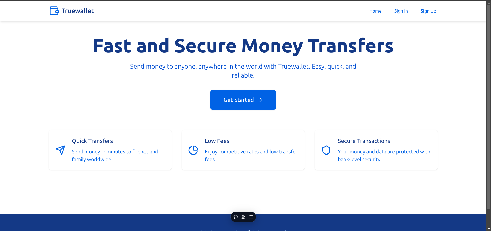

# TrueWallet

TrueWallet is a MERN stack application designed to provide seamless transaction experiences.



! [Live Link](https://true-wallet-zeta.vercel.app/)


## Tech Stack

- **Frontend**: React.js
- **Backend**: Node.js, Express.js
- **Database**: MongoDB

## Project Structure

This project is organized into two main parts:

- **frontend**: Contains the React.js application.
- **backend**: Contains the Node.js server and API logic.

## Getting Started

Follow these instructions to set up and run the project on your local machine.

### Prerequisites

- Node.js and npm installed on your machine.
- MongoDB installed and running locally or accessible via a connection string.

### Installation

1. **Clone the repository:**

   ```bash
   git clone https://github.com/anuj846k/TrueWallet
   cd TrueWallet

   ```

2. **Install frontend dependencies:**

```bash
cd frontend
npm install
```

3. **Install backend dependencies:**

```bash
cd ../backend
npm install
```

## Environment Variables

If your project requires environment variables, create a .env file in the backend directory and add the following:

```
MONGO_URI=<your-mongodb-uri>
SECRET_KEY=<your-secret-key>
```

## Running the Application

### Backend

Navigate to the backend directory and start the server:

```bash
cd backend
npm start
```

### Frontend

Navigate to the frontend directory and start the React app:

```bash
cd frontend
npm start
```

The application is typically available at http://localhost:3000

## Contributing

Contributions are welcome! Please fork the repository and submit a pull request.
